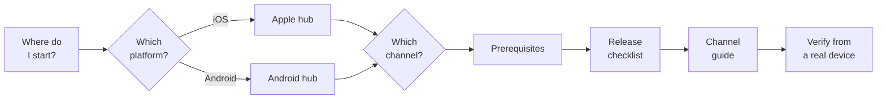

# .NET MAUI App Distribution

An authoritative, verified guide to distributing .NET MAUI mobile applications, covering
**ten channels** across Apple and Android.

Every material instruction is grounded in current, first-party Apple, Google or Microsoft
documentation, with a `Last Verified` date recorded against it. Where a command or its output is
shown as executed, it was run and its real result quoted — and where a command **cannot** produce
what its own log claims, that is documented too.

---

## How to use this guide

Start at the table below, pick a platform, pick a channel, settle the prerequisites, then work
down that platform's checklist with the channel guide open beside it.

## Start here

| If you are... | Read |
|---|---|
| New to all of this | [Choose your distribution channel](start-here/choose-your-distribution-channel.md) |
| Deciding what to set up first | [Prerequisites overview](start-here/prerequisites-overview.md) |
| Comparing the two platforms | [iOS vs Android comparison](start-here/platform-comparison.md) |
| Ready to ship on iOS | [iOS end-to-end release checklist](start-here/apple/release-checklist.md) |
| Ready to ship on Android | [Android end-to-end release checklist](start-here/android/release-checklist.md) |

## Choose your platform

| Platform | Channels | Hub |
|---|---|---|
| Apple / iOS | 4 | [Apple platform hub](platforms/apple/README.md) |
| Android / Google | 6 | [Android platform hub](platforms/android/README.md) |

## All ten channels

Each guide follows the same fixed twenty-section contract, so the same information sits in the
same place in every one. The quick start is a condensed path for a reader who already knows the
platform.

| Channel | Platform | Guide | Quick start |
|---|---|---|---|
| App Store public release | Apple | [Guide](platforms/apple/app-store-public-release/README.md) | [Quick start](platforms/apple/app-store-public-release/docs/quick-start.md) |
| TestFlight | Apple | [Guide](platforms/apple/testflight/README.md) | [Quick start](platforms/apple/testflight/docs/quick-start.md) |
| Ad hoc distribution | Apple | [Guide](platforms/apple/ad-hoc-distribution/README.md) | [Quick start](platforms/apple/ad-hoc-distribution/docs/quick-start.md) |
| Apple Business Manager / enterprise distribution | Apple | [Guide](platforms/apple/business-manager-and-enterprise/README.md) | [Quick start](platforms/apple/business-manager-and-enterprise/docs/quick-start.md) |
| Google Play public release | Android | [Guide](platforms/android/google-play-public-release/README.md) | [Quick start](platforms/android/google-play-public-release/docs/quick-start.md) |
| Google Play internal testing | Android | [Guide](platforms/android/google-play-internal-testing/README.md) | [Quick start](platforms/android/google-play-internal-testing/docs/quick-start.md) |
| Google Play closed testing | Android | [Guide](platforms/android/google-play-closed-testing/README.md) | [Quick start](platforms/android/google-play-closed-testing/docs/quick-start.md) |
| Google Play open testing | Android | [Guide](platforms/android/google-play-open-testing/README.md) | [Quick start](platforms/android/google-play-open-testing/docs/quick-start.md) |
| Managed Google Play / Android Enterprise distribution | Android | [Guide](platforms/android/managed-google-play-enterprise/README.md) | [Quick start](platforms/android/managed-google-play-enterprise/docs/quick-start.md) |
| Direct APK distribution | Android | [Guide](platforms/android/direct-apk-distribution/README.md) | [Quick start](platforms/android/direct-apk-distribution/docs/quick-start.md) |

## Reference

| Document | What it holds |
|---|---|
| [Channel catalogue](docs/channel-catalogue.md) | Every channel in scope, and the twenty-section contract each guide follows |
| [Controlled terminology](docs/reference/terminology.md) | One term per concept, using each vendor's own official term |
| [Channel completeness matrix](docs/reference/channel-completeness-matrix.md) | Per-channel coverage across eleven review areas, and what each area rests on — documentation, or execution |
| [Requirements and freshness register](docs/reference/requirements-freshness-register.md) | Every time-sensitive requirement, its source, and when to re-check it |

## How this guide is kept true

Nothing here is reported as correct because it was written. Before each release of this guide,
checks are run to confirm that:

- every internal heading anchor resolves, so no cross-reference is silently broken;
- every page has exactly one title, and the table of contents above lists every channel in the
  catalogue with a link that works;
- every channel guide completed all twenty of its required sections;
- every time-sensitive requirement carries its source and a verification date; and
- every external source cited is reachable.

Those checks are maintained separately from this guide, so what is published here is the verified
result rather than the machinery that verifies it. Their findings are what the `Last Verified`
dates rest on.

**Be aware of what that costs you as a reader.** Because the tooling is not in this repository,
you cannot re-run it, and these five statements are not independently falsifiable from what you
have in front of you. The claims you *can* check yourself are the ones each guide makes in its own
§9 and §18 — the commands, their exact output, and what was explicitly not executed. Weigh those
more heavily than this section.

**Two build warnings to carry into your own project**, both found here by execution:

- `dotnet publish -f net10.0-ios -c Release` **writes no `.ipa`** while printing that it did, and
  exiting 0 with 0 warnings. The mechanism matches the still-open
  [dotnet/macios#20958](https://github.com/dotnet/macios/issues/20958), though that issue's repro
  differs from the command run here. **List the file; never read the log.** There is no
  self-signed fallback: an `.ipa` needs a real Apple identity.
- `dotnet publish -f net10.0-android -c Release` **fails from a clean tree** with `XAGNM7009`.
  Adding `-p:AndroidEnableMarshalMethods=false` makes it succeed. The failure and the fix were both
  observed here; Microsoft does not document that property as the remedy for that error, so treat
  the link as inference and the property as a mitigation, not a default.

## Scope

Microsoft and Windows application distribution is **out of scope** for this phase. The objective
is mobile application distribution; Windows distribution may be added later if there is a clear
need.

Most channels here are **documented, not demonstrated** — each guide says which it is in its own
section 18. Only Google Play public release and direct APK distribution have build paths that were
executed **successfully**, producing an artefact confirmed on disk. The two Apple builds were also
executed, but what they demonstrate is their *failure* modes, recorded exactly. **No channel has a
verified upload, review or installation.**

## Changes

See [`CHANGELOG.md`](CHANGELOG.md). Where a claim in this guide was wrong, the changelog says so
rather than describing the correction as an improvement.

## Licence

MIT — see [`LICENSE`](LICENSE).
