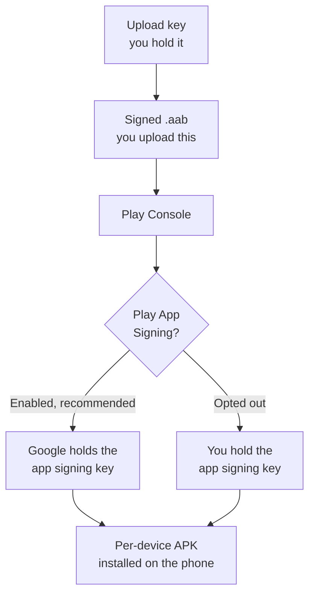

# Android / Google Distribution

Everything Android, in one place: the six distribution channels, and the material all of them
share.

**New here?** [Choose your channel](../../start-here/choose-your-distribution-channel.md) ·
[Prerequisites](../../start-here/prerequisites-overview.md) ·
[Android release checklist](../../start-here/android/release-checklist.md)

## Channels

| Channel | Reaches | Review | Use it when |
|---|---|---|---|
| [Google Play public release](google-play-public-release/README.md) | Anyone | Yes — app review | You are shipping to the public |
| [Internal testing](google-play-internal-testing/README.md) | Up to 100 named testers | Often skipped | You want the fastest feedback loop |
| [Closed testing](google-play-closed-testing/README.md) | Invited testers or lists | Yes | You need a controlled group, or are working towards production access |
| [Open testing](google-play-open-testing/README.md) | Anyone who opts in | Yes | You want a public beta |
| [Managed Google Play](managed-google-play-enterprise/README.md) | Named organisations only | Yes | Distribution is private to an enterprise |
| [Direct APK](direct-apk-distribution/README.md) | Anyone you give the file to | None | No store is involved at all |

**Open testing requires production access first; closed testing does not.** Closed testing is
the route *to* production access for a personal account created after 2023-11-13: 12 testers,
opted in continuously for 14 days. Internal testing needs no production access either, but it
does not satisfy that requirement.

## Signing and keystores

**Two keys, and the difference matters.** The **upload key** signs what you send to Play Console.
The **app signing key** signs what a device installs.

**Which key you can lose matters.** With Play App Signing enabled, Google can help you replace a
lost **upload** key. If you opted out, a lost **app signing** key ends your ability to update that
listing at all.

The authoritative explanation lives in
[Google Play public release §7](google-play-public-release/README.md#7-security-model) and
[§10](google-play-public-release/README.md#10-sign). Every Android channel references it.

**Never commit a keystore or its passwords.** Pass them by the `env:` or `file:` prefix so the
passphrase never reaches the build log.

## Prerequisites common to all six channels

- A **Google Play Console** developer account, US $25 one-time, with identity verification
  complete. Direct APK distribution is the one exception: it needs no account at all.
- A **package name**, permanent once you publish with it, and not reusable even after an app is
  unpublished.
- A target **API level** at or above Google's current floor. **API 35 is the currently binding
  floor; API 36 (Android 16) is required for new apps and updates from 2026-08-31**, with an
  extension to 2026-11-01 available on request through Play Console's **Policy status** page.
  Google raises this floor every year, so confirm the current requirement before you build rather
  than trusting any fixed number, including this one.
- An **upload keystore**, for every channel that goes through Play Console.

Each channel guide's §5 lists what it adds to this.

## The build warning that applies to every Android channel

`dotnet publish -f net10.0-android -c Release` **fails from a clean tree** with
`XAGNM7009 ... missing native code generation state`. Adding
`-p:AndroidEnableMarshalMethods=false` makes it succeed and write a real `.aab`.

**Treat that property as a mitigation, not a recommendation** — it disables a startup
optimisation.

**A long project path fails the same step differently.** Microsoft documents
[`APT2264`](https://learn.microsoft.com/en-us/dotnet/android/messages/apt2264) as the resource-
compiler error caused specifically by exceeding the Windows maximum path length; a long path can
also surface as `APT2098` ("failed to open file") or `APT2261` ("file failed to compile"). These
are .NET for Android's own `APT2`-prefixed codes for `aapt2` failures — the prefix is not a
misspelling of the tool's name. Microsoft's remedy for all three is the same: shorten the path,
enable Windows long-path support, or redirect `$(BaseIntermediateOutputPath)` nearer the drive
root via `Directory.Build.props`. Build at the project's real path rather than a temporary copy.

## Package format

Google Play requires the **App Bundle** (`.aab`) for new apps. The `.apk` is for local install and
direct distribution only. `AndroidPackageFormats` — note the plural — controls which is produced.

## Release management

Every Play channel needs the **version code** to increase on every upload. The version name is for
humans and is not checked for ordering.

**Make the first release deliberately.** Play App Signing is configured on your first release, and
the key you sign it with becomes your upload key for every release afterwards. Google does **not**
document a requirement that this first upload be made by hand rather than through the Play
Developer API — the API supports uploading a bundle and creating a draft release — so treat the
"upload the first one manually" advice as a way to slow yourself down at the one irreversible step,
not as a platform rule.

## Troubleshooting

Each channel guide carries its own §17. Three failures are common across the Play channels:

| Symptom | Usual cause |
|---|---|
| A tester cannot see the app | Either they have not accepted the opt-in link, or they are enrolled on a track that excludes them |
| Upload rejected for a duplicate version | The version code has already been used on any track, not just this one |
| Production publishing is blocked | The store listing, content rating or Data safety declaration is incomplete |

## Where to go next

- The Apple equivalent of this page: [Apple platform hub](../apple/README.md)
- Side by side: [iOS vs Android comparison](../../start-here/platform-comparison.md)
- The full channel list, including scope decisions:
  [channel catalogue](../../docs/channel-catalogue.md)
