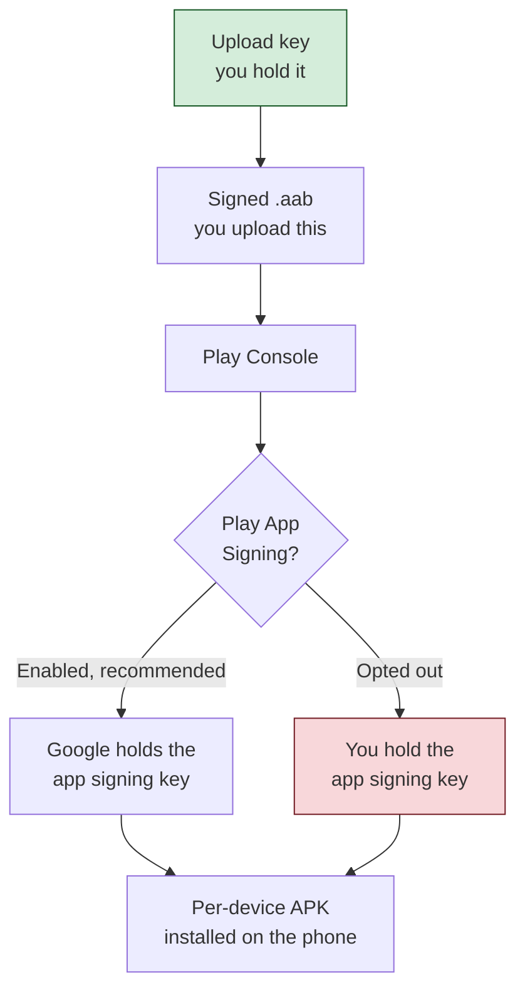

# Android / Google Distribution

Everything Android, in one place: the six distribution channels, and the material all of them

share.

**New here?** [Choose your channel](../../start-here/choose-your-distribution-channel.md) ·

[Prerequisites](../../start-here/prerequisites-overview.md) ·

[Android release checklist](../../start-here/android/release-checklist.md)

## Channels

| Channel | Reaches | Review | Use it when |

|---|---|---|---|

| [Google Play public release](google-play-public-release/README.md) | Anyone | Play Review | You are shipping to the public |

| [Internal testing](google-play-internal-testing/README.md) | Up to 100 named testers | Often skipped | You want the fastest feedback loop |

| [Closed testing](google-play-closed-testing/README.md) | Invited testers or lists | Yes | You need a controlled group, or production access |

| [Open testing](google-play-open-testing/README.md) | Anyone who opts in | Yes | You want a public beta |

| [Managed Google Play](managed-google-play-enterprise/README.md) | Named organisations only | Yes | Distribution is private to an enterprise |

| [Direct APK](direct-apk-distribution/README.md) | Anyone you give the file to | None | No store is involved at all |

**⚠️ Closed and open testing both require production access first.** That makes neither usable as

a starting point for a brand-new personal account. Internal testing does not.

## Signing and keystores

**Two keys, and the difference matters.** The **upload key** signs what you send to Play Console.

The **app signing key** signs what a device installs. With Play App Signing enabled, Google holds

the app signing key and can help you recover a lost *upload* key — but a lost *app signing* key is

unrecoverable if you opted out of Play App Signing.

The authoritative explanation lives in

[Google Play public release §7](google-play-public-release/README.md#7-security-model) and

[§10](google-play-public-release/README.md#10-sign). Every Android channel references it.

**Which key you can lose matters.** With Play App Signing enabled, Google can help you replace a

lost **upload** key. If you opted out, a lost **app signing** key ends your ability to update that

listing at all.

**⚠️ Never commit a keystore or its passwords.** Pass them by the `env:` or `file:` prefix so the

passphrase never reaches the build log.

## Prerequisites common to all six channels

- A **Google Play Console** developer account, US $25 one-time, with identity verification

  complete. Direct APK distribution is the one exception: it needs no account at all.

- A **package name**, permanent once you publish with it, and not reusable even after an app is

  unpublished.

- A target **API level** at or above Google's current floor: API 35 now, **API 36 from

  2026-08-31**.

- An **upload keystore**, for every channel that goes through Play Console.

Each channel guide's §5 lists what it adds to this.

## The build warning that applies to every Android channel

`dotnet publish -f net10.0-android -c Release` **fails from a clean tree** with

`XAGNM7009 ... missing native code generation state`. Adding

`-p:AndroidEnableMarshalMethods=false` makes it succeed and write a real `.aab`.

**Treat that property as a mitigation, not a recommendation** — it disables a startup

optimisation. A long project path can fail the same step with `APT2098` or `APT2261`; build at the

project's real path rather than a temporary copy.

## Package format

Google Play requires the **App Bundle** (`.aab`) for new apps. The `.apk` is for local install and

direct distribution only. `AndroidPackageFormats` — note the plural — controls which is produced.

## Release management

Every Play channel needs the **version code** to increase on every upload. The version name is for

humans and is not checked for ordering.

The **first** production upload must be made manually through Play Console: it establishes the

signing-key relationship every later release depends on.

## Troubleshooting

Each channel guide carries its own §17. Three failures are common across the Play channels:

| Symptom | Usual cause |

|---|---|

| A tester cannot see the app | Either they have not accepted the opt-in link, or they are enrolled on a track that excludes them |

| Upload rejected for a duplicate version | The version code has already been used on any track, not just this one |

| Production publishing is blocked | The store listing, content rating or Data safety declaration is incomplete |

## Where to go next

- 🍎 The Apple equivalent of this page: [Apple platform hub](../apple/README.md)

- 📚 Side by side: [iOS vs Android comparison](../../start-here/platform-comparison.md)

- The full channel list, including scope decisions:

  [channel catalogue](../../docs/channel-catalogue.md)

