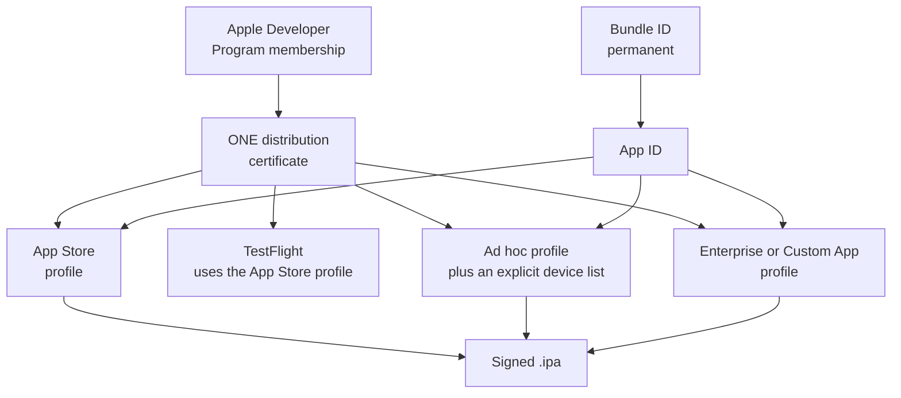

# Apple / iOS Distribution

Everything Apple, in one place: the four distribution channels, and the material all of them
share.

**New here?** [Choose your channel](../../start-here/choose-your-distribution-channel.md) ·
[Prerequisites](../../start-here/prerequisites-overview.md) ·
[iOS release checklist](../../start-here/apple/release-checklist.md)

## Channels

| Channel | Reaches | Review | Use it when |
|---|---|---|---|
| [App Store public release](app-store-public-release/README.md) | Anyone | App Review | You are shipping to the public |
| [TestFlight](testflight/README.md) | 100 internal, 10,000 external testers | Beta review, external only | You need feedback before a public release |
| [Ad hoc distribution](ad-hoc-distribution/README.md) | Registered devices only, capped at 100 per product family per year | None | You need a build on specific known devices |
| [Business Manager and enterprise](business-manager-and-enterprise/README.md) | Your organisation, or named organisations | Varies by programme | Distribution is internal or private |

## Signing and provisioning

**One certificate, several profiles.** App Store public release, TestFlight and ad hoc
distribution all sign with the **same Apple distribution certificate**. They do **not** share a
provisioning profile: an ad hoc profile embeds an explicit device list and is generated
separately.

The certificate is the single point of failure: lose its private key and every profile above it
must be regenerated. The authoritative explanation lives in
[App Store public release §7](app-store-public-release/README.md#7-security-model) and
[§10](app-store-public-release/README.md#10-sign). Every Apple channel references it rather than
repeating it.

**Losing the certificate's private key is the expensive mistake.** Recovering means revoking and
re-issuing, then regenerating every profile that referenced it. Back it up before you build
anything you intend to ship.

## Prerequisites common to all four channels

- An active **Apple Developer Program** membership. The Enterprise Program is a separate
  programme with its own eligibility, covered in the enterprise guide.
- A **Bundle ID**, registered in your Apple Developer account, matching `<ApplicationId>` in the
  project file. **That property is the only place it lives** — single-project MAUI generates the
  bundle identifier from it, and `Platforms/iOS/Info.plist` carries no `CFBundleIdentifier` to
  cross-check or keep in step. It is permanent once you publish with it.
- **Xcode 26 with an iOS 26 SDK**, required for anything **uploaded** to App Store Connect from
  2026-04-28. Apple frames this as an upload requirement, not a submission one.
- A **Mac** for the signing and packaging steps.

Each channel guide's §5 lists what it adds to this.

## The build warning that applies to every Apple channel

`dotnet publish -f net10.0-ios -c Release` **exits 0, reports 0 warnings, prints
`Created the package: ...ipa`, and writes no file.** The SDK's `Publish` target emits that line
whenever `BuildIpa` is set, without ever reaching the target that writes the package.

**A real `.ipa` needs two things, not one:** a genuine Apple signing identity **and** the archive
properties (`-p:ArchiveOnBuild=true -p:RuntimeIdentifier=ios-arm64`). Signing without archiving
still produces no file; archiving without signing fails with `Code signing must be enabled to
create an Xcode archive.` See
[App Store public release §10](app-store-public-release/README.md#10-sign) for the full command.

**List the file. Never read the log.** This cost one wrong claim in this guide before it was
caught, and it is why every Apple channel's packaging step says to check the filesystem.

## Release management

Every Apple channel increases **both** the version and the build number on every submission.
App Store Connect rejects a build whose build number it has already seen for that version, and
the error names the collision rather than the rule.

## Troubleshooting

Each channel guide carries its own §17 for failures specific to it. Three are common to all four:

| Symptom | Usual cause |
|---|---|
| The publish folder is empty after a successful build | Expected without a signing identity. See the warning above |
| `No signing certificate found` | The certificate is not in the keychain, or the profile references a different one |
| A profile stops working after a certificate change | Profiles embed the certificate. Regenerate every profile after re-issuing |

## Where to go next

- The Android equivalent of this page: [Android platform hub](../android/README.md)
- Side by side: [iOS vs Android comparison](../../start-here/platform-comparison.md)
- The full channel list, including scope decisions:
  [channel catalogue](../../docs/channel-catalogue.md)
