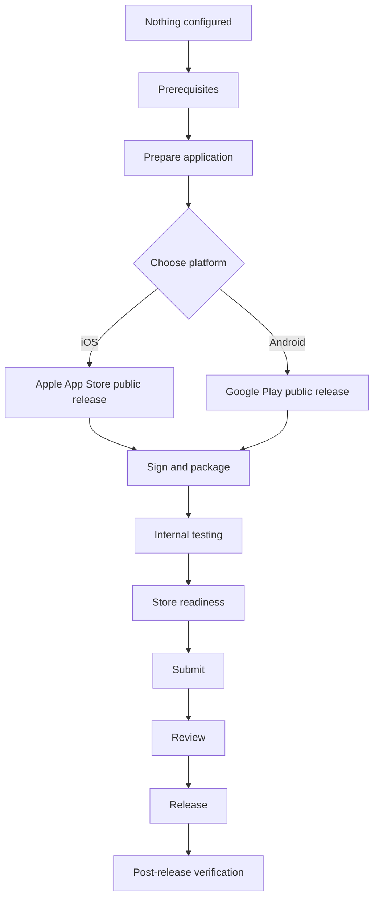

# Choose Your Distribution Channel

This repository currently documents two channels: public release through the **Apple App
Store**, and public release through **Google Play**. Most .NET MAUI apps that reach the public
need both, since Apple and Android users cannot install from each other's store.

## Overall lifecycle

## Which channel do I need?

| Your situation | Read this first |
|---|---|
| Publishing to the general public on iOS | [`platforms/apple/app-store-public-release/README.md`](../platforms/apple/app-store-public-release/README.md) |
| Publishing to the general public on Android | [`platforms/android/google-play-public-release/README.md`](../platforms/android/google-play-public-release/README.md) |
| Beta testing before a public iOS release | [`platforms/apple/testflight/README.md`](../platforms/apple/testflight/README.md) |
| Beta testing before a public Android release | Not yet documented — see the catalogue |
| Distributing only inside your own organisation | Not yet documented — see the catalogue |
| Distributing on Windows | Out of scope for this phase — see the catalogue |

See [`docs/maui-distribution-channel-catalogue-v1.0.0.md`](../docs/maui-distribution-channel-catalogue-v1.0.0.md)
for the complete list of channels this repository's scope covers, including those not yet
documented.

## Platform hubs, comparison, and authoritative checklists

- [Apple / iOS platform hub](../platforms/apple/README.md) — every Apple channel in one place.
- [Android / Google platform hub](../platforms/android/README.md) — every Android channel in one place.
- [iOS vs Android — Platform Comparison](platform-comparison.md) — side-by-side prerequisites, signing, testing, review and release.
- [🍎 iOS End-to-End Release Checklist](ios-release-checklist.md) — the authoritative execution path, prerequisites through post-release verification.
- [🤖 Android End-to-End Release Checklist](android-release-checklist.md) — the equivalent authoritative execution path for Android.

## Before you start either channel

Read [`prerequisites-overview.md`](prerequisites-overview.md) first. Some prerequisites —
supported .NET MAUI version, application identifier, versioning, icons — apply to both channels
and are worth settling before you pick one.
