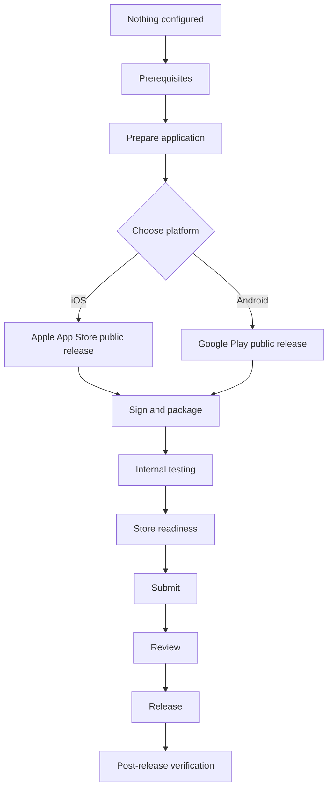

# Choose Your Distribution Channel

This repository documents **ten channels**: four Apple and six Android. Most .NET MAUI apps that
reach the public need one from each platform, since Apple and Android users cannot install from
each other's store.

Start from the table below. If you only want the public stores, you need **App Store public
release** and **Google Play public release**, and nothing else here is required.

## Overall lifecycle

## Which channel do I need?

| Your situation | Read this first |
|---|---|
| Publishing to the general public on iOS | [`platforms/apple/app-store-public-release/README.md`](../platforms/apple/app-store-public-release/README.md) |
| Publishing to the general public on Android | [`platforms/android/google-play-public-release/README.md`](../platforms/android/google-play-public-release/README.md) |
| Beta testing before a public iOS release | [`platforms/apple/testflight/README.md`](../platforms/apple/testflight/README.md) |
| Beta testing before a public Android release | [`platforms/android/google-play-internal-testing/README.md`](../platforms/android/google-play-internal-testing/README.md) for a small trusted group, then [closed](../platforms/android/google-play-closed-testing/README.md) and [open](../platforms/android/google-play-open-testing/README.md) testing |
| Distributing to registered iOS devices without any store | [`platforms/apple/ad-hoc-distribution/README.md`](../platforms/apple/ad-hoc-distribution/README.md) |
| Distributing only inside your own organisation, Apple | [`platforms/apple/business-manager-and-enterprise/README.md`](../platforms/apple/business-manager-and-enterprise/README.md) |
| Distributing only inside your own organisation, Android | [`platforms/android/managed-google-play-enterprise/README.md`](../platforms/android/managed-google-play-enterprise/README.md) |
| Installing an Android build directly, no store at all | [`platforms/android/direct-apk-distribution/README.md`](../platforms/android/direct-apk-distribution/README.md) |
| Distributing on Windows | Out of scope for this phase — see the catalogue |

See [`docs/maui-distribution-channel-catalogue-v1.0.0.md`](../docs/maui-distribution-channel-catalogue-v1.0.0.md)
for the complete list of channels this repository's scope covers. Every one of them is
documented; the catalogue's "not yet documented" section is deliberately kept and empty.

## Platform hubs, comparison, and authoritative checklists

- [Apple / iOS platform hub](../platforms/apple/README.md) — every Apple channel in one place.
- [Android / Google platform hub](../platforms/android/README.md) — every Android channel in one place.
- [iOS vs Android — Platform Comparison](platform-comparison.md) — side-by-side prerequisites, signing, testing, review and release.
- [🍎 iOS End-to-End Release Checklist](ios-release-checklist.md) — the authoritative execution path, prerequisites through post-release verification.
- [🤖 Android End-to-End Release Checklist](android-release-checklist.md) — the equivalent authoritative execution path for Android.

## Before you start either channel

Read [`prerequisites-overview.md`](prerequisites-overview.md) first. Some prerequisites —
supported .NET MAUI version, application identifier, versioning, icons — apply to both channels
and are worth settling before you pick one.
