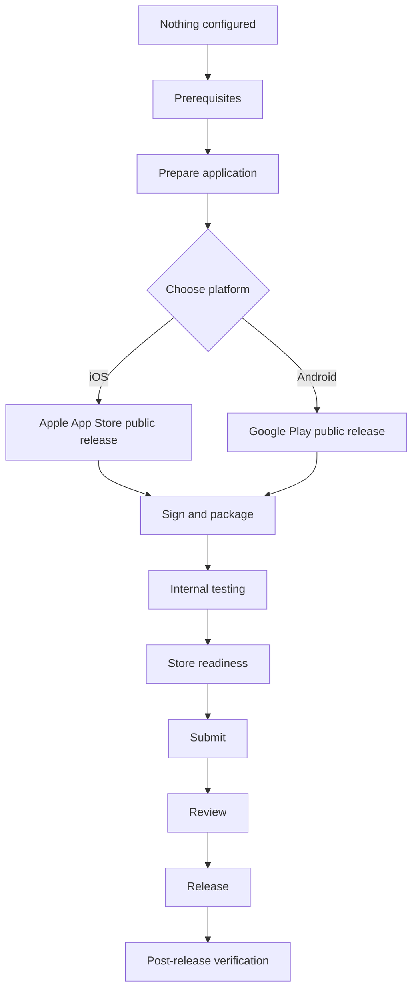

# Choose Your Distribution Channel

This repository currently documents two channels: public release through the **Apple App
Store**, and public release through **Google Play**. Most .NET MAUI apps that reach the public
need both, since Apple and Android users cannot install from each other's store.

## Overall lifecycle

## Which channel do I need?

| Your situation | Read this first |
|---|---|
| Publishing to the general public on iOS | [`channels/AppleAppStorePublicRelease/README.md`](../channels/AppleAppStorePublicRelease/README.md) |
| Publishing to the general public on Android | [`channels/GooglePlayPublicRelease/README.md`](../channels/GooglePlayPublicRelease/README.md) |
| Beta testing before a public iOS release | Not yet documented — see the catalogue |
| Beta testing before a public Android release | Not yet documented — see the catalogue |
| Distributing only inside your own organisation | Not yet documented — see the catalogue |
| Distributing on Windows | Out of scope for this phase — see the catalogue |

See [`docs/maui-distribution-channel-catalogue-v1.0.0.md`](../docs/maui-distribution-channel-catalogue-v1.0.0.md)
for the complete list of channels this repository's scope covers, including those not yet
documented.

## Before you start either channel

Read [`prerequisites-overview.md`](prerequisites-overview.md) first. Some prerequisites —
supported .NET MAUI version, application identifier, versioning, icons — apply to both channels
and are worth settling before you pick one.
