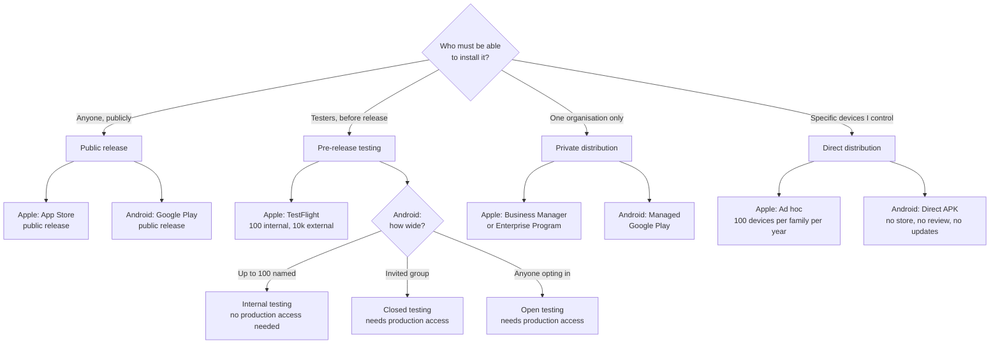
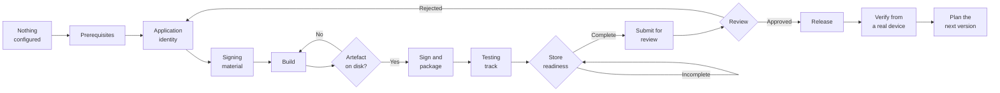

# Choose Your Distribution Channel

This repository documents **ten channels**: four Apple and six Android. Most .NET MAUI apps that
reach the public need one from each platform, since Apple and Android users cannot install from
each other's store.

If you only want the public stores, you need **App Store public release** and **Google Play public
release**, and nothing else here is required.

## Which channel do I need?

Answer the questions in order. The first match is your channel.

** Two constraints decide more than preference does.** Android closed and open testing both
require production access first, so neither works as a starting point for a new personal account.
Apple does not permit the Enterprise Program where another route would serve.

| Your situation | Read this first |
|---|---|
| Publishing to the general public on iOS | [App Store public release](../platforms/apple/app-store-public-release/README.md) |
| Publishing to the general public on Android | [Google Play public release](../platforms/android/google-play-public-release/README.md) |
| Beta testing before a public iOS release | [TestFlight](../platforms/apple/testflight/README.md) |
| Beta testing before a public Android release | [Internal testing](../platforms/android/google-play-internal-testing/README.md) for a small trusted group, then [closed](../platforms/android/google-play-closed-testing/README.md) and [open](../platforms/android/google-play-open-testing/README.md) testing |
| Distributing to registered iOS devices without any store | [Ad hoc distribution](../platforms/apple/ad-hoc-distribution/README.md) |
| Distributing only inside your own organisation, Apple | [Business Manager and enterprise](../platforms/apple/business-manager-and-enterprise/README.md) |
| Distributing only inside your own organisation, Android | [Managed Google Play](../platforms/android/managed-google-play-enterprise/README.md) |
| Installing an Android build directly, no store at all | [Direct APK distribution](../platforms/android/direct-apk-distribution/README.md) |
| Distributing on Windows | Out of scope for this phase — see the catalogue |

See the [channel catalogue](../docs/channel-catalogue.md) for the
complete list this repository's scope covers. Every one of them is documented; the catalogue's
"not yet documented" section is deliberately kept and empty.

## From nothing configured to a verified release

The shape is the same on both platforms. Only the gate names differ.

** The `Artefact on disk?` gate is not decoration.** On iOS the build prints that it created a
package it did not write. On Android the build fails from a clean tree without one extra property.
Both checklists make this an explicit step because both have caught people out.

## Platform hubs, comparison, and authoritative checklists

- [Apple / iOS platform hub](../platforms/apple/README.md) — every Apple channel in one place.
- [Android / Google platform hub](../platforms/android/README.md) — every Android channel in one place.
- [iOS vs Android comparison](platform-comparison.md) — side by side on prerequisites, signing, testing, review and release.
- [iOS end-to-end release checklist](apple/release-checklist.md) — the authoritative execution path.
- [Android end-to-end release checklist](android/release-checklist.md) — the same, for Android.

## Before you start

Read the [prerequisites overview](prerequisites-overview.md) first. Some prerequisites — the
supported .NET MAUI version, the application identifier, versioning and icons — apply to every
channel and are worth settling before you pick one.
